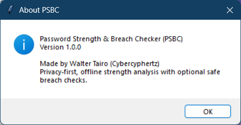
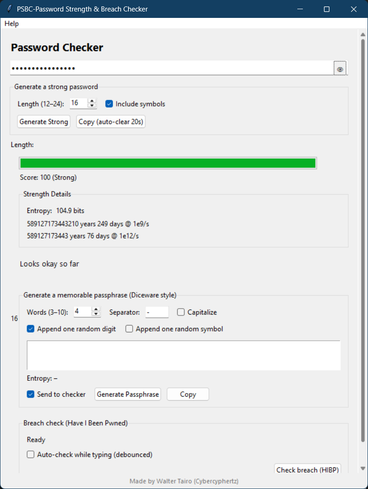
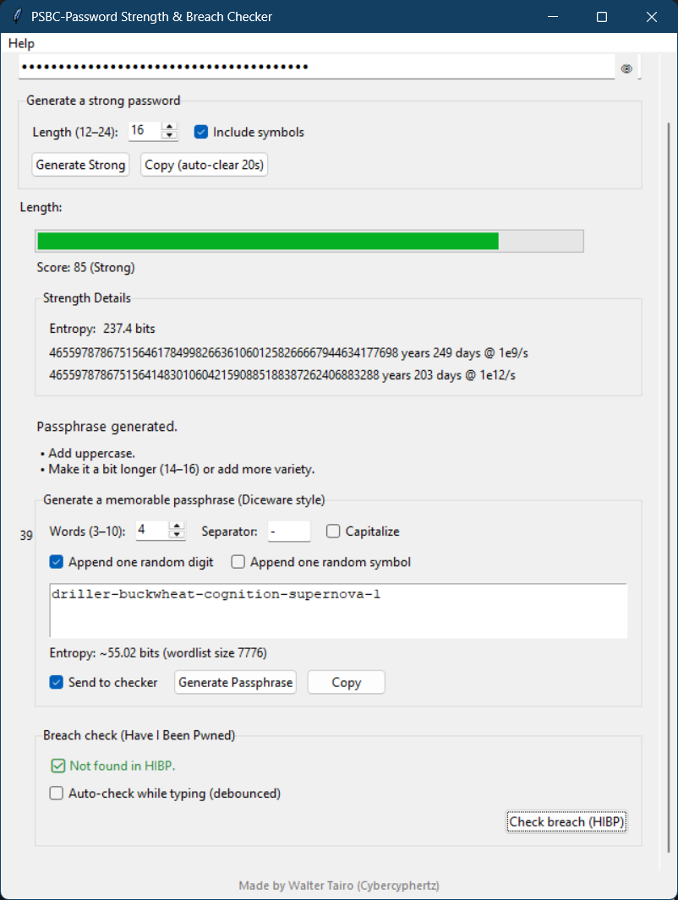

# 🔐 Password Strength & Breach Checker

[](LICENSE)
[](https://github.com/Waltertairo/password-strength-breach-checker/releases/latest)
[](https://github.com/Waltertairo/password-strength-breach-checker/releases)
[](https://github.com/Waltertairo/password-strength-breach-checker/commits/main)
[](https://github.com/Waltertairo/password-strength-breach-checker/issues)

**Privacy-first tool** to analyze password strength and safely check if a password appears in known data breaches (Have I Been Pwned — k-anonymity).  
Includes a **secure password generator** and **Diceware-style passphrase** generator.

[](https://github.com/Waltertairo/password-strength-breach-checker/releases/latest)

---

## ✨ Features
- Offline password strength analysis (length, character diversity, entropy)
- Pattern detection (sequences, repeats, common words)
- Optional online breach check via HIBP k-anonymity (privacy-preserving)
- Strong password generator + Diceware-style passphrases
- Clean UI: show/hide password, scrollable window
- Windows build (.exe installer)

---

## 📸 Screenshots
<p align="center">
  
</p>

<p align="center">
  
  
</p>


---

## 🚀 Install & Run

### Option A — Windows Installer (recommended)
1. Download the latest **Setup** from the **[Releases page](https://github.com/Waltertairo/password-strength-breach-checker/releases/latest)**.
2. Run the installer and launch the app.

**Verify the download (optional):**
```powershell
Get-FileHash ".\PSBC-Setup.exe" -Algorithm SHA256

---

## 🤝 Contributing
See [CONTRIBUTING.md](CONTRIBUTING.md) for guidelines on how to open Issues, make changes, and submit Pull Requests.

---

## 📝 Code of Conduct
This project follows a [Code of Conduct](CODE_OF_CONDUCT.md).  
By participating, you are expected to uphold this code.

